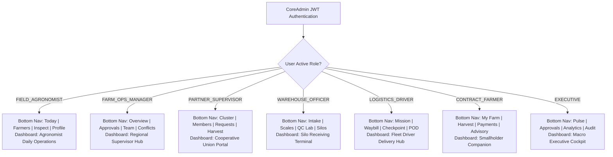

# Z•ORISIS Mobile Field ERP — Role-Based Screen Design & Google Stitch Specification

> **Stitch Project:** `Z•ORISIS Agri-ERP Admin Console` (ID: `4091360251638112319`)  
> **Source Microservice:** `services/core-admin-service` (Authentication, JWT claims, Roles, Permissions, Organizational Scopes)  
> **Specification Discovery:** `docs/AgriERP_Specification_Document.md` & `docs/Agriculture_ERP_Microservices_Breakdown.md`  
> **Target Client Code:** `frontend/mobile-field-app` (Flutter + Riverpod + SQLite)

---

## 1. Implementation Audit: Existing vs. Needed Screens

### 1.1 Existing Baseline Screens (Already in Stitch & Flutter)
The authentication and baseline profile screens are already completed and verified. **Do not re-generate these in Stitch**:

| Screen Name | Stitch Screen Folder | Flutter Source File | Status | Notes |
|---|---|---|---|---|
| **Welcome / Splash** | `z_orisis_mobile_welcome_splash_screen` | `lib/presentation/screens/auth/welcome_splash_screen.dart` | ✅ Complete | Brand logo, offline status indicator, routing |
| **Login** | `z_orisis_mobile_login_screen` | `lib/presentation/screens/auth/login_screen.dart` | ✅ Complete | Email/password, local woreda gateway IP, remember me |
| **MFA Verification** | `z_orisis_mobile_mfa_verification_screen` | `lib/presentation/screens/auth/mfa_verification_screen.dart` | ✅ Complete | 6-digit TOTP / SMS OTP, dev code bypass, timer |
| **Profile & Security** | `z_orisis_mobile_profile_security_screen` | `lib/presentation/screens/profile/profile_security_screen.dart` | ✅ Complete | User info, biometric toggle, role switcher, logout |

### 1.2 Audit of Current Non-Role-Based Screens
The remaining screens currently in `lib/presentation/screens` are legacy generic prototypes that **lack role-based branching**:
1. `home/dashboard_screen.dart` (and Stitch `z_orisis_mobile_home_screen`): Hardcodes a fictional *"Abebe Tesfaye, Farm Manager"* with fixed metric cards, ignoring user roles from `core-admin-service`.
2. `home/main_nav_screen.dart`: Hardcodes 4 fixed tabs (`Home`, `Farms`, `Tasks`, `Profile`) for all users regardless of their actual job duties.
3. `farmer_registration_screen.dart`, `field_inspection_screen.dart`, `parcel_mapping_screen.dart`: Basic single-card forms lacking multi-step workflows, offline queue states, and field-level permissions.

---

## 2. Dynamic Role-Based Architecture

Upon login, `core-admin-service` returns the authenticated user payload:
```json
{
  "id": "u-9401",
  "displayName": "Dawit Kebede",
  "branch": { "code": "BR-JIM-01", "name": "Jimma Woreda Hub", "region": "Oromia" },
  "roles": ["FIELD_AGRONOMIST"],
  "permissions": ["farmer:create", "parcel:map", "inspection:create", "input:distribute"]
}
```

The Flutter app resolves the **Primary Active Role** and dynamically swaps the dashboard, navigation bar, and accessible action sheets:



---

## 3. Exact Google Stitch Generation Catalog (By Role)

Below is the definitive catalog of role-based screens. Each section contains the **Exact Screen ID**, **Screen Title**, and the **Turnkey Prompt** ready to be given directly to Google Stitch.

---

### SUITE 1: Field Agronomist & Extension Agent (`FIELD_AGRONOMIST`)

#### SCR-AG-01: Field Agronomist Home Dashboard
- **Stitch Screen ID:** `z_orisis_mobile_agronomist_home_dashboard`
- **Screen Title:** `Z•ORISIS — Field Agronomist Home Dashboard`
- **Target Role:** `FIELD_AGRONOMIST`
- **Bottom Navigation Tabs:** `Home` (Active), `Farmers`, `Inspections`, `Profile`
- **Google Stitch Prompt:**
  ```text
  Mobile dashboard screen for an agricultural Field Agronomist in Africa for "Z•ORISIS".
  Modern African Agritech Enterprise design on a warm off-white surface (#effdf3).
  Header with greeting "Good morning, Dawit", woreda location chip "Oromia • Jimma Hub", and offline sync status pill "12 Queued".
  Row of 4 high-contrast operational metric cards:
  1. "142 Active Farmers" (+4 this week)
  2. "320.5 ha Mapped" (94% verified)
  3. "6 Visits Due Today" (2 urgent)
  4. "88% Cluster Vigour" (Healthy)
  Horizontal scrollable quick-action buttons: "+ Register Farmer" (forest green), "+ Walk Boundary" (emerald), "+ Log Inspection" (amber), "+ Issue Inputs" (purple).
  "Today's Itinerary" timeline section showing 3 farm parcel visits with farmer name, crop variety (Teff, Maize), and one-touch phone call & map icons.
  Bottom persistent navigation bar with 4 tabs: Home, Farmers, Inspections, Profile.
  ```

#### SCR-AG-02: Outgrower Farmer Registration Wizard
- **Stitch Screen ID:** `z_orisis_mobile_farmer_registration_wizard`
- **Screen Title:** `Z•ORISIS — Outgrower Farmer Registration Wizard`
- **Target Role:** `FIELD_AGRONOMIST`, `PARTNER_SUPERVISOR`
- **Google Stitch Prompt:**
  ```text
  Mobile 4-step wizard form screen for registering smallholder farmers in Z-ORISIS Agriculture ERP.
  Step progress bar at top showing: "1. Identity" (active) -> "2. Location" -> "3. Finance" -> "4. Verification".
  Card container with rounded-xl white surface.
  Form inputs for Ethiopian 3-part naming: "First Name", "Father's Name", "Grandfather's Name".
  Gender radio selector (Male/Female) and Date of Birth picker.
  Dropdown for "National ID Type" (Fayda National ID vs Kebele ID Card) with ID Number input.
  Interactive camera slot button: "Capture Physical ID Card" with live photo preview.
  Input for 10-digit primary mobile phone number formatted for Telebirr ("09...").
  Bottom sticky action dock with "Save Offline Draft" (outline button) and "Continue to Location" (solid forest green #0b3d2e button).
  Offline storage indicator at top right.
  ```

#### SCR-AG-03: Farmer 360° Profile & Reliability Directory
- **Stitch Screen ID:** `z_orisis_mobile_farmer_profile_directory`
- **Screen Title:** `Z•ORISIS — Farmer 360 Profile & Reliability Directory`
- **Target Role:** `FIELD_AGRONOMIST`, `FARM_OPS_MANAGER`
- **Google Stitch Prompt:**
  ```text
  Mobile farmer detail profile screen for Z-ORISIS Agriculture ERP.
  Top header with back button, farmer portrait avatar with verified badge, full name "Tadesse Gemechu", Kebele location "Mana Woreda • Bilida", and direct call/SMS shortcut buttons.
  Prominent circular Reliability Score badge "92/100 (Grade A Outgrower)" with subtext "100% Loan Repayment • 4 Seasons".
  Segmented content tabs: "Farm Parcels", "Active Contracts", "Input Credit Ledger".
  Active tab showing 2 linked farm parcels:
  - "Parcel P-JIM-042": 2.4 ha, Red Teff, Vegetative Stage, Healthy
  - "Parcel P-JIM-043": 1.1 ha, Haricot Bean, Flowering Stage
  Floating action button at bottom: "+ Record Inspection".
  ```

#### SCR-AG-04: GPS Parcel Boundary Mapping Tool
- **Stitch Screen ID:** `z_orisis_mobile_gps_parcel_mapping_screen`
- **Screen Title:** `Z•ORISIS — GPS Parcel Boundary Mapping Tool`
- **Target Role:** `FIELD_AGRONOMIST`
- **Google Stitch Prompt:**
  ```text
  Mobile full-screen GPS land parcel boundary mapping survey interface for Z-ORISIS.
  Map canvas showing a walked boundary polygon drawn with emerald green stroke (#146b45) and translucent fill, with numbered waypoint pins.
  Top floating HUD card displaying:
  - Real-time GPS accuracy badge: "±1.6m (High Precision - RTK/Cellular)" in green
  - Live calculated area: "3.42 Hectares (13.7 Timad)"
  - Perimeter distance: "840 meters"
  Bottom control panel dock:
  - Large tactile circular buttons: "Pause Walk", "Drop Manual Point", "Undo Point", "Finish Polygon"
  - Drawer handle for entering parcel soil classification (Vertisol, Clay, Loam) and irrigation access.
  High outdoor sunlight visibility design with high-contrast text and buttons.
  ```

#### SCR-AG-05: Crop Inspection & Pest Scoring Screen
- **Stitch Screen ID:** `z_orisis_mobile_crop_inspection_scoring_screen`
- **Screen Title:** `Z•ORISIS — Crop Inspection & Pest Scoring Screen`
- **Target Role:** `FIELD_AGRONOMIST`
- **Google Stitch Prompt:**
  ```text
  Mobile field crop inspection and agronomic health assessment form for Z-ORISIS.
  Header with selected parcel "Parcel P-JIM-042 • White Teff".
  Horizontal pill selector for Crop Growth Stage: "Germination", "Vegetative" (active), "Flowering", "Grain Filling", "Maturity".
  Crop Health & Vigour slider bar rated 1 to 5 with status badge "4 - Good Vigour".
  Pest & Disease checklist with severity percentage sliders:
  - Fall Armyworm: 15% (Mild)
  - Leaf Rust: 0% (None)
  Moisture Stress 3-way toggle: "Optimal", "Moderate Drought", "Waterlogged".
  Two camera-only photo slots with embedded GPS coordinates, altitude, and date watermark.
  Text area for "Agronomist Advisory Instructions to Farmer".
  Bottom full-width button: "Submit Inspection to Local Queue".
  ```

#### SCR-AG-06: Input Distribution Handover & Digital Receipt
- **Stitch Screen ID:** `z_orisis_mobile_input_distribution_receipt_screen`
- **Screen Title:** `Z•ORISIS — Input Distribution Handover & Digital Receipt`
- **Target Role:** `FIELD_AGRONOMIST`, `STOREKEEPER`
- **Google Stitch Prompt:**
  ```text
  Mobile agricultural input distribution receipt and farmer handover screen for Z-ORISIS.
  Barcode scanner tile at top with voucher code "VCH-2026-8819".
  Farmer identification card showing name "Abebech Tolosa", phone, and cooperative union.
  Itemized allocation card:
  - Certified Maize Seed: 2 Bags (50 kg)
  - NPSB Fertilizer: 4 Bags (200 kg)
  - Urea Fertilizer: 2 Bags (100 kg)
  Total in-kind credit value: "19,200 ETB (Harvest Deductible)".
  Digital touchscreen signature box for farmer acknowledgement, with alternative tab for "Verify via 6-Digit SMS OTP".
  Storekeeper witness checkbox and solid forest green button "Confirm Handover & Send SMS Receipt".
  ```

---

### SUITE 2: Farming Operations Manager & Field Supervisor (`FARM_OPS_MANAGER`)

#### SCR-MGR-01: Operations Supervisor Hub Dashboard
- **Stitch Screen ID:** `z_orisis_mobile_ops_manager_dashboard`
- **Screen Title:** `Z•ORISIS — Operations Supervisor Hub Dashboard`
- **Target Role:** `FARM_OPS_MANAGER`, `BRANCH_MANAGER`
- **Bottom Navigation Tabs:** `Overview` (Active), `Approvals`, `Team`, `Conflicts`
- **Google Stitch Prompt:**
  ```text
  Mobile operational executive dashboard for a Regional Farming Operations Manager in Z-ORISIS Agriculture ERP.
  Header with regional hub badge "Oromia Regional Operations • Jimma", supervisor avatar, and notification bell with red badge.
  Macro 2x2 operational metrics grid:
  1. "1,840 ha Cultivated" (96% of season target)
  2. "842 Active Outgrowers" (+24 this month)
  3. "92% Agronomy Compliance" (Visits on schedule)
  4. "14 Pending Approvals" (4 high priority)
  Urgent Alert Banner (crimson tint): "Pest alert in Bilida Kebele - Fall Armyworm threshold reached".
  "Priority Approvals Queue" horizontal carousel showing pending parcel polygons and input vouchers with 1-swipe approval buttons.
  Field staff live status summary showing "5 Agronomists Active in Field • 24 Visits Completed Today".
  Bottom navigation with 4 tabs: Overview, Approvals, Team, Conflicts.
  ```

#### SCR-MGR-02: Operations Multi-Workflow Approval Inbox
- **Stitch Screen ID:** `z_orisis_mobile_manager_approval_inbox`
- **Screen Title:** `Z•ORISIS — Operations Multi-Workflow Approval Inbox`
- **Target Role:** `FARM_OPS_MANAGER`
- **Google Stitch Prompt:**
  ```text
  Mobile workflow approval inbox screen for farming operations manager in Z-ORISIS.
  Top segmented filter tabs: "All (14)", "Parcels (5)", "Input Vouchers (6)", "Suspensions (2)", "Leaves (1)".
  Card list of approval requests:
  - Card 1: "Parcel GPS Survey Verification" - Farmer Hailu D., 3.8 ha, Jimma Zone. Shows mini map satellite thumbnail with surveyed polygon overlay. Actions: Red outline "Reject" and Green solid "Approve".
  - Card 2: "Input Credit Allocation" - Voucher #VCH-902, 10 Bags Fertilizer, Value 18,500 ETB. Recommender: Agronomist Dawit. Actions: "Decline" / "Approve".
  - Card 3: "Side-Selling Suspension Flag" - Farmer default notice with audit evidence. Actions: "Review Details" / "Confirm Suspension".
  Sticky bottom batch action bar: "Approve Selected (3)" with security PIN icon.
  ```

#### SCR-MGR-03: Sync Conflict Resolution Console
- **Stitch Screen ID:** `z_orisis_mobile_sync_conflict_resolution_screen`
- **Screen Title:** `Z•ORISIS — Sync Conflict Resolution Console`
- **Target Role:** `FARM_OPS_MANAGER`, `SUPER_ADMIN`
- **Google Stitch Prompt:**
  ```text
  Mobile offline sync conflict resolution screen for Z-ORISIS Agriculture ERP.
  Header with alert badge "Sync Conflict #CONF-104 • Farmer Record F-9021".
  Submitting field officer info "Agronomist Abebe • Timestamp: Yesterday 16:40".
  Side-by-side diff comparison cards:
  - Field 1 (Phone Number): Server Master has "0911-223344" vs Field Mobile Submission has "0922-446688 (Updated in Field)"
  - Field 2 (Cultivated Hectares): Server Master has "1.8 ha" vs Field Mobile Submission has "2.4 ha (New Boundary Walked)"
  Radio button options for resolution:
  1. "Keep Server Master (Discard field edit)"
  2. "Accept Field Submission (Overwrite server)"
  3. "Manual Field-by-Field Merge"
  Compulsory manager justification text field for the immutable audit log.
  Solid green action button: "Commit Resolution & Publish Event".
  ```

#### SCR-MGR-04: Agronomist Team Performance & Dispatch
- **Stitch Screen ID:** `z_orisis_mobile_agronomist_team_schedule_screen`
- **Screen Title:** `Z•ORISIS — Agronomist Team Performance & Dispatch`
- **Target Role:** `FARM_OPS_MANAGER`
- **Google Stitch Prompt:**
  ```text
  Mobile field team management and inspection dispatch screen for Z-ORISIS.
  Top header with view toggle: "List View" vs "Live Map".
  Officer performance cards list:
  - "Dawit Kebede" (Lead Agronomist): Status "Checked in at Mana (08:15 AM)", Visits: "5/6 Done", Battery 74%. Button "Reassign".
  - "Almaz Tsegaye" (Extension Agent): Status "In Field • Bilida", Visits: "3/5 Done", Battery 52%. Button "Call".
  - "Bekele Molla": Status "Leave / Absent Today".
  Floating action button: "+ Dispatch Urgent Inspection Mission" with modal trigger for assigning an unassigned parcel alert.
  ```

---

### SUITE 3: Commercial Partner & Cooperative Cluster Leader (`PARTNER_SUPERVISOR`)

#### SCR-PT-01: Partner Cooperative Cluster Dashboard
- **Stitch Screen ID:** `z_orisis_mobile_partner_cooperative_dashboard`
- **Screen Title:** `Z•ORISIS — Partner Cooperative Cluster Dashboard`
- **Target Role:** `PARTNER_SUPERVISOR`, `COOP_LEADER`
- **Bottom Navigation Tabs:** `Cluster` (Active), `Members`, `Requests`, `Harvest`
- **Google Stitch Prompt:**
  ```text
  Mobile cooperative partner dashboard screen for "Z•ORISIS".
  Header card with cooperative union name "Oromia Coffee & Grain Union", Cluster Code "CL-JIM-04", and verified partner badge.
  4 primary KPI metric cards:
  1. "350 Outgrower Members"
  2. "1,250 ha Contracted"
  3. "94.2% Loan Recovery"
  4. "18,500 Quintals Quota"
  "Seasonal Delivery Pipeline" progress meter showing 12,400 / 18,500 Quintals delivered (67% complete, 18 days remaining in season).
  Quick action buttons: "+ Enroll Member", "+ Input Requisition", "+ Collection Intake", "+ Report Problem".
  Bulletins card showing official advisories from Z-ORISIS central agronomy team.
  Bottom navigation with 4 tabs: Cluster, Members, Requests, Harvest.
  ```

#### SCR-PT-02: Cooperative Member Roster & Enrollment
- **Stitch Screen ID:** `z_orisis_mobile_cluster_member_enrollment_screen`
- **Screen Title:** `Z•ORISIS — Cooperative Member Roster & Enrollment`
- **Target Role:** `PARTNER_SUPERVISOR`
- **Google Stitch Prompt:**
  ```text
  Mobile member roster and enrollment screen for farm cooperative leaders in Z-ORISIS.
  Top search bar with filter chips: "All (350)", "Contract Signed (320)", "Pending Verification (22)", "Default Risk (8)".
  Member card list showing:
  - Farmer name, Fayda ID number, Kebele location, total landholding (ha), and status pill.
  Floating bottom action button: "+ Enroll New Member".
  Modal drawer preview for enrolling new member: Name, ID upload, landholding certificate green book number, and cooperative endorsement signature.
  ```

#### SCR-PT-03: Cluster Input Credit Requisition Order
- **Stitch Screen ID:** `z_orisis_mobile_input_credit_requisition_screen`
- **Screen Title:** `Z•ORISIS — Cluster Input Credit Requisition Order`
- **Target Role:** `PARTNER_SUPERVISOR`
- **Google Stitch Prompt:**
  ```text
  Mobile bulk input requisition order form for cooperative supervisors in Z-ORISIS.
  Header referencing Master Agreement "AGR-2026-COOP-09".
  Product item cards with quantity increment/decrement steppers:
  - Certified Soya Bean Seed: [ - ] 200 Bags (50kg) [ + ]
  - NPSB Fertilizer: [ - ] 450 Bags (50kg) [ + ]
  - Bio-inoculant: [ - ] 200 Vials [ + ]
  Summary card calculating total metric tonnage (32.5 MT) and estimated in-kind loan value (1,240,000 ETB).
  Delivery depot selection dropdown.
  Solid green action button: "Submit Cluster Requisition for Approval".
  ```

#### SCR-PT-04: Village Collection Depot Intake Slip
- **Stitch Screen ID:** `z_orisis_mobile_village_collection_intake_screen`
- **Screen Title:** `Z•ORISIS — Village Collection Depot Intake Slip`
- **Target Role:** `PARTNER_SUPERVISOR`, `AGGREGATION_AGENT`
- **Google Stitch Prompt:**
  ```text
  Mobile harvest intake and drop-off recorder screen for rural collection depots in Z-ORISIS.
  Search bar to find delivering member farmer by name or member ID.
  Selected farmer card: "Girma Lemma • Bilida Kebele".
  Intake fields:
  - Crop Commodity dropdown (White Teff, Soya, Red Kidney Beans)
  - Number of bags delivered: Stepper counter (e.g. 24 Bags)
  - Total gross weight in Quintals: Number input (e.g. 24.0 Qt)
  - Handheld moisture meter reading %: (e.g. 11.5%)
  Print / SMS slip preview showing generated intake number "DRP-2026-9041".
  Button: "Issue Collection Receipt & Notify Farmer via SMS".
  ```

---

### SUITE 4: Warehouse Weighbridge & QC Receiving Officer (`WAREHOUSE_OFFICER`)

#### SCR-WH-01: Grain Silo Intake & Weighbridge Dashboard
- **Stitch Screen ID:** `z_orisis_mobile_warehouse_intake_dashboard`
- **Screen Title:** `Z•ORISIS — Grain Silo Intake & Weighbridge Dashboard`
- **Target Role:** `WAREHOUSE_OFFICER`, `STOREKEEPER`
- **Bottom Navigation Tabs:** `Intake` (Active), `Scales`, `QC Lab`, `Silos`
- **Google Stitch Prompt:**
  ```text
  Mobile warehouse intake dashboard for grain silo terminal in Z-ORISIS Agriculture ERP.
  Header showing facility name "Nazareth Central Silo Terminal" and scale indicator "Weighbridge Scale 1: Online & Zeroed".
  Capacity metrics card showing 3 vertical silo cylinder progress meters:
  - Silo A (Teff): 84% (2,520 / 3,000 MT)
  - Silo B (Maize): 45% (1,350 / 3,000 MT)
  - Silo C (Soya): 18% (540 / 3,000 MT)
  "Today's Receiving Summary": 284 MT received across 14 trucks.
  "Incoming Truck Queue" card list showing arriving trucks with plate numbers (e.g. "ET-3-90812"), driver name, commodity, and current stage badge ("At Gate", "On Scale", "In QC Lab", "Unloading").
  Bottom action button: "+ New Inbound Weight Ticket".
  ```

#### SCR-WH-02: Weighbridge Intake Weight Ticket
- **Stitch Screen ID:** `z_orisis_mobile_weighbridge_ticket_screen`
- **Screen Title:** `Z•ORISIS — Weighbridge Intake Weight Ticket`
- **Target Role:** `WAREHOUSE_OFFICER`, `WEIGHBRIDGE_OPERATOR`
- **Google Stitch Prompt:**
  ```text
  Mobile weighbridge truck weight intake ticket screen for Z-ORISIS.
  Waybill scan button with barcode icon and Waybill Code "WB-88102".
  Truck plate number "ET-3-82910" and transporter name "Oromia Freight Union".
  Large prominent high-visibility digital scale display:
  - "GROSS WEIGHT: 34,520 kg" (Live scale reading with green Bluetooth connection badge)
  - "TARE WEIGHT: 12,100 kg" (Post-unloading scale reading)
  - "NET CARGO WEIGHT: 22,420 kg (224.2 Quintals)" in bold emerald green
  Variance calculation card comparing origin dispatch weight (22,500 kg) vs received weight (-80 kg / -0.35% transit loss - Acceptable tolerance).
  Button: "Save Weight Ticket & Route to QC Station".
  ```

#### SCR-WH-03: Rapid Grain QC Inspection & Grading
- **Stitch Screen ID:** `z_orisis_mobile_rapid_qc_grading_screen`
- **Screen Title:** `Z•ORISIS — Rapid Grain QC Inspection & Grading`
- **Target Role:** `QC_INSPECTOR`
- **Google Stitch Prompt:**
  ```text
  Mobile quality control inspection and grading form for grain receiving in Z-ORISIS.
  Header with Lot Batch Number "LOT-2026-TEF-091" and Commodity "White Teff (Magna)".
  Form inputs for laboratory inspection parameters:
  - Moisture Content %: Number input (e.g. "11.8%") with target threshold (Max 13.0%)
  - Purity Rate %: (e.g. "98.5%")
  - Foreign Matter / Weed Seeds %: (e.g. "1.2%")
  - Broken & Shriveled Grain %: (e.g. "2.0%")
  - Live Insect Infestation Checkbox: "Negative / Clean"
  - Aflatoxin Strip Test: Toggle "Negative (<10 ppb)" vs "Positive"
  Automated Grade Result Banner in emerald green: "GRADE 1 - EXPORT QUALITY".
  QC Inspector signature box and button: "Authorize Quality Grade & Issue GRN".
  ```

#### SCR-WH-04: Goods Received Note (GRN) & Lot Tag Generator
- **Stitch Screen ID:** `z_orisis_mobile_grn_silo_allocation_screen`
- **Screen Title:** `Z•ORISIS — Goods Received Note (GRN) & Lot Tag Generator`
- **Target Role:** `WAREHOUSE_OFFICER`, `STOREKEEPER`
- **Google Stitch Prompt:**
  ```text
  Mobile Goods Received Note (GRN) finalization and lot tag printing screen for Z-ORISIS.
  Official receipt card with generated GRN code "GRN-2026-0819", verified net weight "224.2 Quintals", and Quality "Grade 1 Export".
  Storage Destination Selector: Dropdown for Silo / Bay ("Silo A - Aerated Bin 04") showing updated bin capacity meter.
  Printable QR/Barcode Lot Tag card preview containing QR code, Lot ID, harvest origin woreda, and date.
  Action buttons: "Print Bluetooth Lot Tag" (outline) and "Confirm Storage & Update ERP Inventory" (solid green).
  ```

---

### SUITE 5: Logistics & Fleet Driver (`LOGISTICS_DRIVER`)

#### SCR-DRV-01: Driver Active Trip Manifest & Waybill
- **Stitch Screen ID:** `z_orisis_mobile_driver_trip_manifest_screen`
- **Screen Title:** `Z•ORISIS — Driver Active Trip Manifest & Waybill`
- **Target Role:** `LOGISTICS_DRIVER`
- **Bottom Navigation Tabs:** `Mission` (Active), `Waybill`, `Checkpoint`, `POD`
- **Google Stitch Prompt:**
  ```text
  Mobile trip manifest and delivery mission screen for cargo truck drivers in Z-ORISIS.
  Active trip banner with Waybill number "WAYBILL-ET-9941", vehicle plate "ET-3-82910", and status badge "In Transit".
  Route visualizer stepper card:
  - Origin: "Jimma Aggregation Hub" (Departed 06:30 AM)
  - Current: "Near Mojo Checkpoint" (Estimated arrival 03:00 PM)
  - Destination: "Adama Central Silo Hub" (Remaining: 84 km)
  Cargo manifest summary table:
  - Soya Beans (Grade 1), 400 Bags, 20.0 Metric Tons
  Container Security Seals card with seal numbers "SEAL-A901" and "SEAL-A902" with verification status.
  Bottom action bar: "Report Delay / Incident" (Amber button) and "Arrived at Destination" (Emerald button).
  ```

#### SCR-DRV-02: Transit Incident & Checkpoint Delay Reporter
- **Stitch Screen ID:** `z_orisis_mobile_transit_delay_incident_screen`
- **Screen Title:** `Z•ORISIS — Transit Incident & Checkpoint Delay Reporter`
- **Target Role:** `LOGISTICS_DRIVER`
- **Google Stitch Prompt:**
  ```text
  Mobile transit delay and incident reporting screen for truck drivers in Z-ORISIS.
  Incident type chip selectors: "Mechanical Breakdown", "Road Obstruction / Landslide", "Police / Weighbridge Checkpoint", "Severe Weather".
  Delay duration stepper: [ - ] 2 Hours [ + ].
  Automated GPS coordinate card showing current truck position with map thumbnail.
  Camera slot for vehicle breakdown or road obstruction photo proof.
  Text area for driver notes.
  Warning-themed action button: "Broadcast Transit Alert to Logistics Dispatch".
  ```

#### SCR-DRV-03: Proof of Delivery (POD) & Warehouse Handover
- **Stitch Screen ID:** `z_orisis_mobile_proof_of_delivery_pod_screen`
- **Screen Title:** `Z•ORISIS — Proof of Delivery (POD) & Warehouse Handover`
- **Target Role:** `LOGISTICS_DRIVER`, `WAREHOUSE_OFFICER`
- **Google Stitch Prompt:**
  ```text
  Mobile Proof of Delivery (POD) digital sign-off screen for agricultural logistics in Z-ORISIS.
  Arrival destination card "Adama Central Silo Hub".
  Container seal inspection radio: "Both Seals Intact & Verified".
  Destination weighbridge ticket match confirmation badge.
  Recipient Storekeeper confirmation card:
  - 6-digit receiver security OTP input field
  - Touchscreen digital signature capture box
  Camera photo capture button for the stamped physical paper waybill.
  Solid emerald green button: "Complete Delivery Handover & Close Trip".
  ```

---

### SUITE 6: Contract Farmer Companion (`CONTRACT_FARMER`)

#### SCR-FRM-01: Farmer Farm & Crop Progress Overview
- **Stitch Screen ID:** `z_orisis_mobile_farmer_farm_overview_screen`
- **Screen Title:** `Z•ORISIS — Farmer Farm & Crop Progress Overview`
- **Target Role:** `CONTRACT_FARMER`
- **Bottom Navigation Tabs:** `My Farm` (Active), `Harvest`, `Payments`, `Advisory`
- **Google Stitch Prompt:**
  ```text
  Mobile smallholder farmer companion home screen for Z-ORISIS.
  Clean, high-contrast, low-cognitive-load layout with Ethiopian language options (Amharic / Afaan Oromoo / English).
  Warm greeting "እንደምን አደሩ፣ አቶ ታደሰ (Good morning, Tadesse)" with cooperative badge.
  Parcel status card: "Parcel 1 • Red Teff", with a visual crop growth stage progress bar at "Flowering Stage (65% toward harvest)".
  Agronomist visit banner: "Next scheduled inspection: Thursday, 12 Oct (Dr. Kebede)".
  Financial quick-strip cards:
  - Active Input Credit Loan: "4,500 ETB"
  - Total Harvest Delivered: "18 Quintals"
  USSD shortcut button: "Dial *888# for Offline SMS Balance".
  ```

#### SCR-FRM-02: Farmer Input Loan & Settlement Ledger
- **Stitch Screen ID:** `z_orisis_mobile_farmer_ledger_settlement_screen`
- **Screen Title:** `Z•ORISIS — Farmer Input Loan & Settlement Ledger`
- **Target Role:** `CONTRACT_FARMER`
- **Google Stitch Prompt:**
  ```text
  Mobile farmer financial settlement ledger screen for Z-ORISIS Agriculture ERP.
  Top summary card showing net seasonal earnings:
  - Total Gross Harvest Value: "+48,000 ETB"
  - Input Credit Deductions (Seed & Fertilizer): "-12,400 ETB"
  - Transport & Bagging Fee: "-1,600 ETB"
  - "NET TELEBIRR DISBURSEMENT: 34,000 ETB (Paid 24 Sep)" highlighted in emerald green with Telebirr transaction code.
  Chronological itemized transaction list with expandable receipt cards for each delivery.
  Dispute button: "Request Settlement Clarification".
  ```

#### SCR-FRM-03: Localized Agro-Weather Advisory & Extension Tips
- **Stitch Screen ID:** `z_orisis_mobile_weather_advisory_tips_screen`
- **Screen Title:** `Z•ORISIS — Localized Agro-Weather Advisory & Extension Tips`
- **Target Role:** `CONTRACT_FARMER`, `FIELD_AGRONOMIST`
- **Google Stitch Prompt:**
  ```text
  Mobile agricultural weather forecast and agronomy advisory screen for farmers in Z-ORISIS.
  Top card with hyper-local woreda weather: "Jimma Woreda • 24°C", 5-day rainfall forecast bar chart showing "85% Rain Expected on Friday - Postpone fertilizer broadcasting".
  Audio voice note card: Playable 60-second audio clip recorded by research agronomists in Amharic with play/pause button and waveform visualizer.
  Illustrated seasonal advice cards: "Optimal weeding schedule", "Safe chemical storage guidelines".
  ```

---

### SUITE 7: Executive Leadership & Approver Snapshot (`EXECUTIVE` / `SUPER_ADMIN`)

#### SCR-EXEC-01: Executive Macro Pulse Dashboard
- **Stitch Screen ID:** `z_orisis_mobile_executive_pulse_dashboard`
- **Screen Title:** `Z•ORISIS — Executive Macro Pulse Dashboard`
- **Target Role:** `EXECUTIVE`, `CEO`, `COO`, `SUPER_ADMIN`
- **Bottom Navigation Tabs:** `Pulse` (Active), `Approvals`, `Analytics`, `Audit`
- **Google Stitch Prompt:**
  ```text
  Executive enterprise pulse dashboard screen on mobile for agribusiness leadership in Z-ORISIS.
  Sleek dark green and gold-accented cards showing macro enterprise KPIs:
  1. "14,280 ha Planted" (+12% YoY)
  2. "6,420 Active Farmers" (98% contracted)
  3. "88.5% Export Quota" (On track)
  4. "94.1% Loan Recovery" (Strong)
  Regional intake comparison bar chart comparing intake volumes across Oromia, Amhara, and Sidama hubs.
  High-risk flags section (2 delayed transport corridors, 1 silo near capacity).
  "Executive Approval Deck" horizontal card showing high-threshold purchase orders and partnership agreements awaiting CEO signature.
  ```

#### SCR-EXEC-02: Executive High-Value Fast Approvals
- **Stitch Screen ID:** `z_orisis_mobile_executive_fast_approval_screen`
- **Screen Title:** `Z•ORISIS — Executive High-Value Fast Approvals`
- **Target Role:** `EXECUTIVE`, `CEO`, `FINANCE_DIRECTOR`
- **Google Stitch Prompt:**
  ```text
  Mobile executive approval screen for high-value agricultural contracts and purchase orders in Z-ORISIS.
  Card layout detailing high-threshold request: "Commercial Partner Master Agreement > 500 Hectares".
  Partner: "Awash Agricultural Cooperative Union".
  Total Financial Exposure: "3,200,000 ETB".
  Multi-tier approval audit trail badges: "Legal Reviewed ✓", "Finance Audited ✓", "Pending CEO Sign-off".
  One-tap PDF contract preview button.
  Separation of Duties verification badge ensuring requester and approvers are distinct individuals.
  Slide-to-approve slider bar with biometric fingerprint icon. Red outline "Reject" button.
  ```

---

## 4. Master Navigation & State Model (Flutter Implementation)

When these screens are generated by Google Stitch and coded into Flutter:

1. **Root Nav Host (`main_nav_screen.dart`):**
   Replaces the current hardcoded 4 tabs with a **Role-Aware Dynamic Scaffold**:
   ```dart
   Widget build(BuildContext context, WidgetRef ref) {
     final user = ref.watch(authProvider).user;
     final primaryRole = user?.roles.firstOrNull ?? 'FIELD_AGRONOMIST';
     
     final (tabs, screens) = switch (primaryRole) {
       'FIELD_AGRONOMIST' => (agronomistTabs, agronomistScreens),
       'FARM_OPS_MANAGER' => (managerTabs, managerScreens),
       'PARTNER_SUPERVISOR' => (partnerTabs, partnerScreens),
       'WAREHOUSE_OFFICER' => (warehouseTabs, warehouseScreens),
       'LOGISTICS_DRIVER' => (driverTabs, driverScreens),
       'CONTRACT_FARMER' => (farmerTabs, farmerScreens),
       _ => (executiveTabs, executiveScreens),
     };
     
     return Scaffold(
       body: IndexedStack(index: currentIndex, children: screens),
       bottomNavigationBar: AgriBottomNavBar(tabs: tabs, currentIndex: currentIndex, onTap: ...),
     );
   }
   ```

2. **Role Switching in `profile_security_screen.dart`:**
   When a user with multiple assigned roles switches context from the top role dropdown, `activeRoleProvider` updates and immediately triggers `main_nav_screen.dart` to rebuild with the appropriate role tabs and dashboard without logging out.
